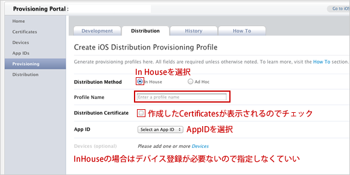
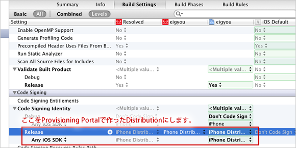

# エンタープライズ版自動ビルドコマンド

## セットアップについて 
### iOS Provisioning PortalにてProvisioningファイルを作成

(1)左側メニューからProvisioningをクリック。

(2) Distributionタブを開いて「New Profile」をクリック。

(3)Provisioningの内容を入力して登録。

(4)Distributionを開いて作成したProvisioning Profilesをダウンロードしてインストール。

### xcode上での設定
(1)各種ビルド設定

Xcodeでは通常通りアプリを作った後、Bundle Identifierは先ほど作ったルールで設定し、Code SigningをProvisioning Portalで作ったDistributionに設定します。
* Release
  - リリース用のビルド設定
* AdHoc
  - エンタープライズ用のビルド設定
* Debug
  - デバッグモード設定

今回はAdHocにて作成。


エンタープライズ用の環境がなければ下記を参照
#### Build Settings にステージング環境を追加

* Project Navigator の最上部にあるプロジェクトファイルを選択
* 「PROJECT」ファイルのアイコンを選択し、「Info」のタブを選択
* 「Configuration」内の + ボタンを押下し任意の名前で追加。この例では「Staging」として追加


## ビルド実行
```
./build.sh
```

Permission deniedエラーが出る場合、パーミッション付加
```
chmod +x auto-build.sh
```


## その他
### ビルドバージョン自動インクリメント化
ぼくは今回初めて知ったのですが、Builde Settings -> Packaging の中に Preprocess Info.plist file という設定項目があり、これにYESを設定することでInfo.plistがBuild Phasesの他の何よりも先にInfo.plistが作成されることになります。
In xcode 5, select Editor -> Add Build Phase -> Add Run Script Build Phase
デバッグモードの場合、日付とコミット番号を付加(http://www.tokoro.me/2014/05/19/xcode-versioning/)
```
if [ ${CONFIGURATION} = "Debug" ]; then
    plistBuddy="/usr/libexec/PlistBuddy"
    infoPlistFileSource="${SRCROOT}/${INFOPLIST_FILE}"
    infoPlistFileDestination="${TEMP_DIR}/Preprocessed-Info.plist"
    
    currentVersion=$($plistBuddy -c "Print CFBundleVersion" $infoPlistFileSource)
    
    versionPrefix="dev-"
    lastCommitDate=$(git log -1 --format='%ci')
    versionSuffix=" ($lastCommitDate)"
    
    versionString=$versionPrefix$currentVersion$versionSuffix
    
    $plistBuddy -c "Set :CFBundleVersion $versionString" $infoPlistFileDestination

else
    buildNumber=$(/usr/libexec/PlistBuddy -c "Print CFBundleVersion" "$INFOPLIST_FILE")
    buildNumber=$(($buildNumber + 1))
    /usr/libexec/PlistBuddy -c "Set :CFBundleVersion $buildNumber" "$INFOPLIST_FILE"
fi
```